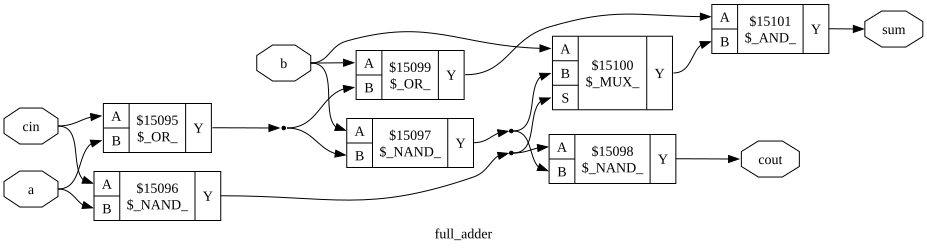

# Single-Cycle MIPS-Style CPU

A 32-bit, single-cycle MIPS-style CPU implemented in SystemVerilog — every instruction fetches, decodes, executes, accesses memory, and writes back within one clock cycle. No pipelining, no hazard logic. The architecture follows the single-cycle MIPS datapath from Harris & Harris's *Digital Design and Computer Architecture*; this is my from-scratch SystemVerilog implementation of it, extended with additional instructions and my own ALU (see [Design origins & disclosures](#design-origins--disclosures) for the full breakdown of what's original vs. adapted).


<sub>*Diagram simplified for readability — a majority of the MCU and ALU Decoder control signals are omitted. See `CPU/src/MCU.sv` and `CPU/src/ALUDecoder.sv` for the complete control logic.*</sub>

## Verification & known limitations

The top-level testbench (`CPU/tb/CPU_tb.sv`) is a hand-written integration program exercising every implemented instruction, with 32 assertions on final register/memory state (30 register checks + 2 memory checks), including a full `jal`/`jr` call-and-return round trip:

```
CPU testbench complete: 32 passed, 0 failed
ALL TESTS PASSED
```


Yosys can also draw what it actually synthesized. Here's `full_adder` — the literal primitive the 32-bit ripple-carry adder is built from — mapped to real gates by ABC (`yosys -p "synth -top CPU; show full_adder"`, rendered with Graphviz):



The same command against the whole `CPU` top level produces a real schematic too, but at 452 cells across 14 submodules it's ~103"×25" as laid out — legible when you zoom into a vector viewer, useless shrunk to fit a README. It's in [`docs/yosys_cpu_schematic.svg`](docs/yosys_cpu_schematic.svg) for anyone who wants to open it directly and pan around.

## Instructions implemented

| Type | Instructions |
|---|---|
| R-type (ALU) | `add` `sub` `and` `or` `xor` `nor` `slt` `sll` `srl` `sra` |
| R-type (control) | `jr` |
| I-type (ALU/immediate) | `addi` `andi` `ori` `lui` |
| I-type (memory) | `lw` `sw` |
| I-type (branch) | `beq` `bne` |
| J-type | `j` `jal` |

## Instruction encoding

Every instruction is a 32-bit word in one of three formats, decoded by `Instruction_Unit/src/decoder_unit.sv`:

**R-type** — register-to-register ALU ops and `jr`

| Bits | 31–26 | 25–21 | 20–16 | 15–11 | 10–6 | 5–0 |
|---|---|---|---|---|---|---|
| Field | `opcode` | `rs` | `rt` | `rd` | `shamt` | `funct` |
| Meaning | always `000000` | source register 1 | source register 2 | destination register | shift amount (`sll`/`srl`/`sra`) | selects the ALU operation |

**I-type** — immediates, loads/stores, branches

| Bits | 31–26 | 25–21 | 20–16 | 15–0 |
|---|---|---|---|---|
| Field | `opcode` | `rs` | `rt` | `immediate` |
| Meaning | selects the operation | source register / base address register | destination register (or 2nd source for `beq`/`bne`/`sw`) | sign- or zero-extended constant, or memory/branch offset |

**J-type** — unconditional jumps

| Bits | 31–26 | 25–0 |
|---|---|---|
| Field | `opcode` | `address` |
| Meaning | selects `j` or `jal` | target instruction address, combined with `PC+4[31:28]` and shifted left 2 |

## Architecture

The CPU is built as independently-verified modules wired together in `CPU/src/CPU.sv`:

| Directory | Contents |
|---|---|
| `Instruction_Unit/` | PC register/update logic, PC+4, branch and jump target calculation, instruction memory, instruction decode |
| `ALU/` | ALU and its sub-units (add/subtract, logic, shift), plus the ALU opcode decoder |
| `Memory/` | Register file, data memory, sign/zero extender, write-back mux |
| `CPU/` | Top-level datapath wiring, the main control unit (MCU), and the ALU control decoder |

Control flow: the **Control Unit (MCU)** decodes `opcode`/`funct` into the control word (`RegDst`, `ALUSrc`, `MemToReg`, `RegWrite`, `MemWrite`, `Branch`, `BranchNE`, `Jump`, `ALUOp`, `ExtOp`, `LU`, `JAL`) that drives every mux and enable pin in the datapath. Two feedback loops close the datapath: the **next-PC mux** (selecting between `PC+4`, branch target, jump target, and the JR register value) feeds back into the PC register, and the **write-back mux** (selecting between ALU result, memory read data, `{imm,16'b0}` for LUI, and `PC+4` for JAL) feeds back into the register file. See the diagram above for the full wiring.


## Running the tests

Requires [Icarus Verilog](https://steveicarus.github.io/iverilog/).

```bash
# build/ is gitignored, so create it on a fresh clone
mkdir -p build

# Top-level CPU testbench
iverilog -g2012 -o build/cpu_tb.out -s CPU_tb $(cat sources.f)
vvp build/cpu_tb.out
```

`sources.f` is just a plain newline-separated list of every RTL source file, in dependency order, passed to `iverilog -f sources.f`; it's the closest thing this repo has to a build file.

Individual module testbenches live alongside their sources in each `tb/` directory (e.g. `ALU/tb/alu_tb.sv`, `Memory/tb/bit_extender_tb.sv`) and can be compiled/run the same way against just their relevant source files.

`instructions.hex` is the program image loaded by `instruction_memory`, hand-assembled machine code with an inline `//` comment above each word documenting its address, mnemonic, and semantics. **Known gap:** there's no assembler in this repo yet — changing the program currently means hand-encoding new instructions the same way.

## Design origins & disclosures

* **Textbook foundation.** The datapath and control scheme are based on the single-cycle MIPS processor in *Digital Design and Computer Architecture* by Sarah L. Harris and David Harris (Chapter 7, Section 7.3, p. 383). That base design covers `add`, `sub`, `and`, `or`, `slt`, `lw`, `sw`, `beq`, `addi`, and `j`. Starting from that architecture, I reimplemented it from scratch in SystemVerilog and extended it with instructions beyond the textbook's base subset: `xor`, `nor`, `sll`, `srl`, `sra`, `jr` (R-type), `andi`, `ori`, `lui` (I-type), `bne` (branch), and `jal` (jump-and-link).

* **ALU reuse.** The ALU (`ALU/src/`) is carried over from an earlier standalone ALU project of mine, with a handful of ports added (shift amount/shift value, additional flag outputs) to integrate it into this CPU. Within it, the adder (`add_subtract_unit.sv`) is  gate-level — a ripple-carry chain built from individually-instantiated `full_adder` primitives, with two's-complement subtraction via a bitwise B-invert and carry-in — while the logic unit, shifter, and decoders are behavioral RTL (`&`/`|`/`^`, shift operators, `case` statements), not gate-level.

* **AI assistance.** Claude was used to help verify the design's correctness — writing/checking testbenches, tracing control logic, and debugging — but the substantial majority of the actual RTL design and code was done fully by me. The read me was formatted courtesy of Claude as well.

## For fun

Curious how this CPU stacks up against, say, an RTX 5090? [`docs/frame-render-estimate.md`](docs/frame-render-estimate.md) is a real-tools-backed Fermi estimate of how long this CPU would take to render one frame of a AAA game at 1080p — including an actual synthesis + place-and-route run against a real FPGA target for the clock speed, not just a guess. Short version: on the order of a month per frame, and the missing hardware multiplier/FPU matters more than the clock speed does.
